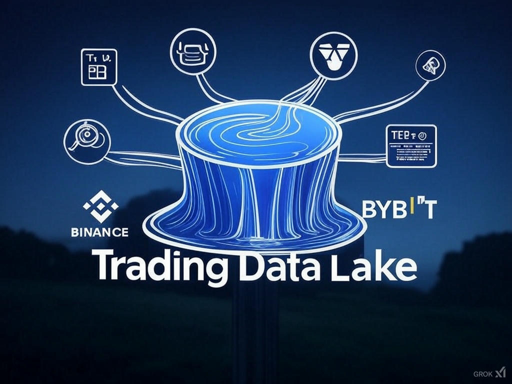

# Trading Data Lake



This repository provides a system for collecting, storing, and managing financial market data from multiple sources, including Binance, Bybit, Yahoo Finance, and more. It is designed to create a centralized "data lake" that can be used for research, analysis, and trading strategy development.

## Features

- **Multi-Source Data Collection:** Supports downloading data from various exchanges and financial data providers.
- **Data Storage:** Organizes data in a structured format for easy analysis.
- **TimescaleDB Integration:** Enables migrating data to TimescaleDB for efficient time-series analysis.
- **Command-Line Interface (CLI):** Provides an intuitive CLI tool for managing data.
- **S&P 500 Data Scraping:** Collects the latest list of S&P 500 companies from [wikipedia](https://en.wikipedia.org/wiki/List_of_S%26P_500_companies).
.
- **Logging:** Implements a logger for monitoring and debugging.

## Supported Data Sources
| Data Source Name         | Description                                                                                                                      | Data Type                                             |
| :---------------------- | :------------------------------------------------------------------------------------------------------------------------------- | :---------------------------------------------------- |
| Binance                 | Cryptocurrency perpetual futures tick data converted into 1-minute OHLCV bars.                                                   | Minute-level (1-minute OHLCV bars) for perpetual futures |
| Bybit                   | Cryptocurrency perpetual futures tick data converted into 1-minute OHLCV bars.                                                   | Minute-level (1-minute OHLCV bars) for perpetual futures |
| Yahoo Finance           | Daily OHLCV (Open, High, Low, Close, Volume) data for stocks (including S&P 500), ETFs, and major forex (FX) pairs.             | Daily OHLCV bars for stocks, ETFs, and forex.          |
| FirstRate Data          | Historical intraday data (e.g., 1-minute bars) for futures from FirstRateData.com.                                    | Minute-level and daily OHLCV for stocks and futures    |
| Trader Workstation (IB) | Historical data via Interactive Brokers TWS API. Requires running TWS or IB Gateway.                              | Daily and intraday data for stocks, ETFs, and futures  |

---

## Installation

### 1. Clone the Repository

```bash
git clone <repository-url>
cd trading-data
```

### 2. Install Dependencies
```python
pip install -r requirements.txt
```

### 3. Configure Environment Variables

Create a .env file in the root directory and add the following:
```plainext
TIMESCALEDB_URI=postgresql+psycopg2://<user>:<password>@<host>:<port>/<database>
```

Replace `user`, `password`, `host`, `port`, and `database` with your TimescaleDB credentials.

### 4. (Optional) Start TimescaleDB with docker
```bash
# https://docs.timescale.com/self-hosted/latest/install/installation-docker/
docker run -d --name timescaledb -p 5432:5432 -e POSTGRES_PASSWORD=123456 timescale/timescaledb:latest-pg14   
```

### 5. Set Up Data Directory

The data directory is ~/.trading-data.

## Usage

Once installed, this project provides a command-line tool `trading-data` that can be run from anywhere in your terminal.

### Adding a New Data Source

To add a new data source:
```bash
trading-data datalake add --name <data_source_name> --start-date <start_date> --end-date <end_date>
```
- `data_source_name`: Name of the data source (e.g., binance, bybit, yfinance).
- `start_date`: Start date for data collection (default: 10 years ago).
- `end_date`: End date for data collection (default: today).

Examples:
```bash
trading-data datalake add --name binance --start-date 2023-01-01 --end-date 2023-12-31
trading-data datalake add --name yfinance
```

### Updating a Data Source

To update an existing data source:
```bash
trading-data datalake update --name <data_source_name> --start-date <start_date> --end-date <end_date>
```

Examples:
```bash
trading-data datalake update --name binance --start-date 2024-01-01 --end-date 2024-01-31
trading-data datalake update --name yfinance --end-date 2024-02-15
```

You can also update selected pdts. If the pdts are not in the current data menu, they will be added in to the data menu.
*Currently this feaute is ONLY for stock products for `ib` data source.*
Examples
```bash
trading-data datalake update --name ib --start-date 2025-02-15 --pdts DUK
trading-data datalake update --name ib --start-date 2025-02-15 --pdts TQQQ,SQQQ,VOO
```

### Migrating Data to TimescaleDB

To migrate data to TimescaleDB:
```bash
trading-data datalake migrate --name <data_source_name> --ver <version_name>
```

- <data_source_name>: Data source name (binance, bybit, yfinance).
- <version_name>: Data version (min_bar, day_bar).

Examples:
```bash
trading-data datalake migrate --name binance --ver min_bar
trading-data datalake migrate --name yfinance --ver day_bar
```

### Getting Data Source Information

To retrieve information about a data source:
```bash
trading-data datalake info --name <data_source_name> --ver <version_name>
```
Examples:

```bash
trading-data datalake info --name binance --ver min_bar
trading-data datalake info --name yfinance --ver day_bar
```

### Deleting a Data Source

To delete an entire data source and all its associated data:
```bash
trading-data datalake delete --name <data_source_name>
```

Example:
```bash
trading-data datalake delete --name bybit
```

## Data Organization

The data lake follows this directory structure:
```plaintext
data/
├── binance/
│   ├── min_bar/
│   │   ├── BTC_USDT_2023-01-01_historical_data.csv
│   │   ├── ETH_USDT_2023-01-01_historical_data.csv
├── bybit/
│   ├── min_bar/
│   │   ├── BTC_USDT_2023-01-01_historical_data.csv
│   │   ├── ETH_USDT_2023-01-01_historical_data.csv
└── yfinance/
    ├── day_bar/
    │   ├── AAPL_historical_data.csv
    │   ├── MSFT_historical_data.csv
```

Each data source has:
- A separate directory (binance, bybit, yfinance).
- Different versions of data (min_bar, day_bar).
- CSV files, partitioned by date and asset.

## Accessing Data Programmatically

Use the DatalakeClient class to access stored data:
```python
from trading_data.datalake_client import DatalakeClient

dl_client = DatalakeClient()

# Fetch daily data for AAPL from Yahoo Finance
df_aapl = dl_client.get_table('yfinance', 'AAPL', ver_name='day_bar')
print(df_aapl.head())

# Fetch minute-level data for BTC/USDT from Bybit
df_btcusdt = dl_client.get_table('bybit', 'BTC_USDT', ver_name='min_bar', date='2023-01-01')
print(df_btcusdt.head())

# Retrieve available time period and assets for Bybit's minute bars
start_date, end_date = dl_client.get_current_time_period('bybit', ver_name='min_bar')
data_menu = dl_client.get_data_menu('bybit')

print(f'Start Date: {start_date}, End Date: {end_date}')
print('Available Assets:')
for asset_type, assets in data_menu.items():
    print(f'{asset_type}: {len(assets)} assets')
```

## Notes
- Error Handling: Basic error handling is included in the CLI commands, but additional robustness may be needed for production use.
- Date Validation: Ensure the specified date range is correct before executing commands.

## Migration Guide

To migrate your data files from the legacy v1 format to the new v2 format, use the provided migration script:

```bash
python scripts/migrate_to_v2.py
```

This script will convert your files to the new naming convention and structure expected by the latest version of the data lake.

`v1` will not be supported after this update.


## Contributing

If you’d like to contribute, feel free to open a pull request or submit an issue.

## License

This project is open-source. See the LICENSE file for more details.

## 📌 Planned Features

| Feature | User Story | Status |
|--------|------------|--------|
| Partial Data Update by Symbols | As a strategy developer, I want to update only a few selected stocks (e.g., AAPL, MSFT) instead of the entire data source, so that I can speed up the data refresh process during targeted strategy development. | ⏳ Done |
